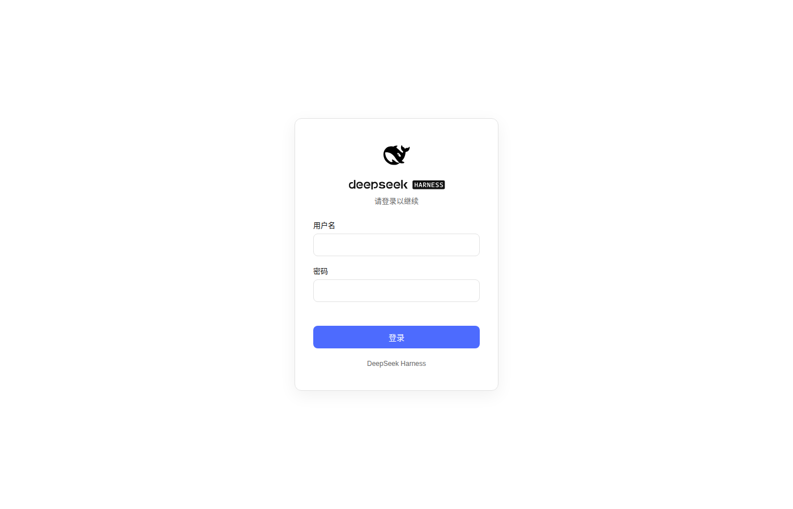

# dsh-web-startup-auth

[中文](README.md) | **English**

A DSH (DeepSeek Harness) plugin that enables **remote web startup with username/password authentication**.



The stock `@deepseek-ai/dsh-web-app/startup` **hard-rejects `--host 0.0.0.0`** for safety. This plugin replaces it and adds an auth layer (login/register page + signed session cookies), letting you safely expose `dsh web` on a LAN or any non-loopback interface.

## Features

- **Remote startup**: `--host 0.0.0.0` works, replacing the stock launcher's hard rejection.
- **Login/register page**: First visit guides you through setting the admin credentials, then shows the login page; matches DSH's black/white/blue style.
- **Session authentication**: Signed session cookie (`dsh_sid`, 14-day expiry, `HttpOnly` + `SameSite=Lax`).
- **API protection**: Every registered route (`/api/*` and third-party RPC routes, except `/api/auth/*` and `/login`) requires a valid session, otherwise returns 401 or refuses the handshake.
- **"Auth" tab in the settings panel**: Injects an "Auth" page into the DSH settings panel with **Sign out** and **Change password**.
- **Remote-scenario fixes** (two LAN/HTTP pitfalls):
  - `crypto.randomUUID` polyfill — the API is missing in non-secure contexts; without it every RPC fails.
  - Privileged API loopback bypass — DSH restricts `settings.*` / `credentials.*` etc., third-party `authority: "loopback"` RPC channels (e.g. `/dsh-automation`, skill managers) and the WebSocket event streams to loopback Host only; after authentication this plugin presents the request as loopback (Host/Origin rewriting covers every registered route and upgrade handshake, including routes registered by third-party plugins that activated earlier).

## Install

This plugin is a DSH **bundle** (the `dsh.bundle.patch` in `package.json` ships a `cordis.patch.yml`). After `dsh plugin` installation the patch layer applies **automatically** — no manual config editing.

```sh
# Option 1: from source
git clone <repo-url>
cd dsh-web-startup-auth
npm install        # install build dependencies (typescript etc.)
npm run build      # compile src/ to lib/ (the runtime loads lib/ artifacts)
dsh plugin --profile web add .

# Option 2: from the npm registry (re-run the same command to upgrade an existing install)
dsh plugin --profile web add dsh-web-startup-auth@latest
```

> `dsh plugin` forwards to pnpm and requires `--profile <name>`; `add .` installs the current directory as a `link:` dependency.

Start:

```sh
dsh web --host 0.0.0.0
```

> Or, if applying the patch manually with `--patch ./cordis.patch.yml`:
> `dsh --profile web --patch ./cordis.patch.yml --host 0.0.0.0`

## Usage

1. Open `http://<host-ip>:<port>/` in a browser.
2. The first visit redirects to `/login`, showing the "set admin credentials" registration form.
3. After registering you are auto-logged-in and land in the UI; subsequent visits require login.
4. Sign out / change password: open the **Settings panel → Auth** tab in the UI (there is also a standalone entry; `POST /api/auth/logout` clears the session cookie).

Credentials and the session secret live in `~/.dsh/web-auth.json`:

- Passwords are stored as **scrypt** hashes (random salt, 64 bytes); plaintext is never saved.
- Session cookies are signed with a random key using **HMAC-SHA256** to prevent forgery.
- **Forgot password**: on the server machine run `dsh --profile web auth-reset` for an interactive reset (or `dsh --profile web auth-reset --password <new-password>` non-interactively). Resetting **rotates the session secret and invalidates every issued session**.
- Fallback: delete `~/.dsh/web-auth.json` and restart to re-register (also invalidates all sessions, but requires a restart).

## Index

If you are looking for an out-of-the-box IDE built for the Agent era, check out [Omniterm](https://github.com/GDWhisper/OmniTerm)

## Security notes

- This plugin provides authentication but **not transport encryption**. Over plaintext HTTP, credentials and traffic can be sniffed on the same network — **use only on a trusted LAN** or put an HTTPS reverse proxy in front.
- Sessions last 14 days; tighten by editing `SESSION_MAX_AGE_SEC` in `src/auth.ts`.
- Password hashing uses Node's built-in `crypto.scryptSync`; no third-party dependency.
- **Sessions cannot be revoked server-side**: `dsh_sid` is a self-contained signed cookie; `/api/auth/logout` only clears it on the browser side. A leaked cookie (e.g. sniffed over plaintext HTTP) cannot be individually revoked within its 14-day window. **Exceptions**: `dsh --profile web auth-reset` and the "Change password" action in the settings panel both **rotate the session secret**, invalidating all sessions at once (after a password change the current session is re-issued, so you stay signed in).
- **First-registration window**: while no credentials are set, any visitor can register as admin. **Complete the first registration before exposing the service to an untrusted network.**
- **Login throttling**: login failures are rate-limited per client IP — 5 consecutive failures lock the client out for 30 seconds (in-memory only, not persisted); registration requires a password of at least 8 characters. Throttling covers `/api/auth/login` and `/api/auth/change-password` (a wrong old password also counts). For stricter protection, add general rate limiting at your reverse proxy.
- **Credential file permissions**: `~/.dsh/web-auth.json` (password hash + session signing key) is saved with `0600`, its directory with `0700`; the plugin repairs overly-broad permissions left by older versions at startup.
- **`--trusted-host`**: kept only for CLI compatibility with the stock launcher; it **plays no part in this plugin's auth decisions** — remote clients always need a valid session; there is no "trusted host skips login".
- **Upstream compatibility layer (dsh ≥ rc.8)**: Since dsh rc.8, settings-panel features backed by the **frontend settings mirror** (the provider directory, plugin config forms) would otherwise fail in a remote browser with `settings are unavailable in this browser` — DSH's frontend decides loopback-ness from the **browser address bar hostname** (`connection.isLoopback`), so remote access is never loopback and the mirror runs in memory mode without issuing settings RPCs. This plugin's **frontend half** overrides that flag and restores the mirror to host mode (paired with the backend loopback bypass), making those pages usable; pages already opened in the session need one refresh. The shim depends on dsh internals (`settingsScope.mirror`) and is verified against rc.8; upstream changes may require a follow-up update.

## Development

```sh
npm install
npm run typecheck   # tsc --noEmit
npm test            # vitest
npm run build       # tsc -p tsconfig.json + tsdown, output to lib/
```

- `tsc` compiles the node-side source (`src/*.ts`) and type declarations to `lib/` and `lib/types/`.
- `tsdown` bundles the frontend plugin (`src/client/index.tsx`) into the browser bundle `lib/client.js` (the `window.__ModuleLoader__.load` registration format). Rebuild after changing frontend code; a `link:` install in the profile picks up new artifacts automatically.
- The `@deepseek-ai/dsh-client-*` packages the frontend plugin depends on are used only for types and building; at runtime they are provided by DSH's frontend module table.

## License

[MIT](./LICENSE)
