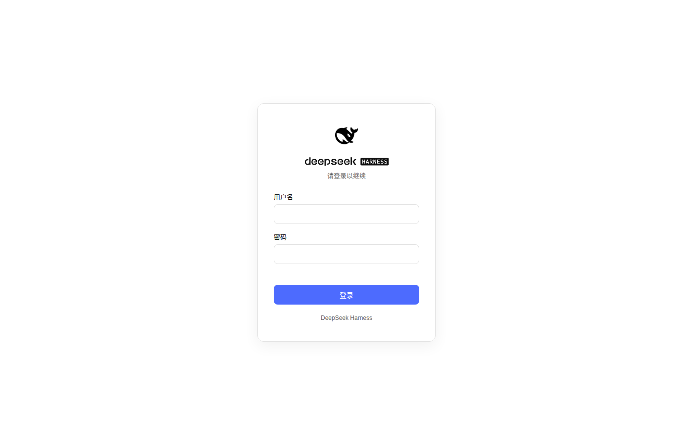

# dsh-web-startup-auth

[中文](README.md) | **English**

A [DSH (DeepSeek Harness)](https://github.com/deepseek-ai/deepseek-harness) plugin that enables **remote web startup with username/password authentication**.

> **⚠️ Version tracking notice**: This project only tracks the official `next` dist-tag (the pre-stable release channel) and does not follow the `alpha` preview channel (current baseline: dsh 0.2.0-rc.1, with all five `@deepseek-ai/dsh-*` dependencies bumped to `^0.2.0-rc.1`; see `docs/upgrade-dsh-0.2.0-playbook.md` for the adaptation review and sentinels).



The stock `@deepseek-ai/dsh-web-app/startup` **hard-rejects `--host 0.0.0.0`** for safety. This plugin replaces it and adds an auth layer (login/register page + signed session cookies), letting you safely expose `dsh web` on a LAN or any non-loopback interface.

## Features

- **Remote startup**: `--host 0.0.0.0` works, replacing the stock launcher's hard rejection; `--host ::` (or any IPv6 literal, e.g. `::1`, `fd00::1`) works too (#35; non-canonical spellings are canonicalized, zone-suffixed (`%eth0`) and IPv4-mapped (`::ffff:a.b.c.d`) ones are refused). On a pure-IPv6 network `0.0.0.0` binds IPv4 only and the GUI is unreachable; `::` is dual-stack on Linux (`net.ipv6.bindv6only=0`) and covers both IPv6 and IPv4-mapped peers; on `bindv6only=1` systems `::` is IPv6-only.
- **Login/register page**: A remote first visit guides you through setting the admin credentials, then shows the login page; matches DSH's black/white/blue style.
- **Password-free local access**: the decision is made per **request**, not per bind address — a request is trusted only when its TCP peer address *and* its `Host` header are both loopback. A browser on the same machine opening `http://127.0.0.1:<port>/` needs no registration or login; LAN clients and requests forwarded by a reverse proxy (`Host` names the public domain) always need a session.
- **Optional human verification (slider puzzle)**: **a bot check that does nothing much, added at a reader's request — feel free to turn it on and see XD.** Flip it on under **Settings → Auth → Human verification** and a login will ask you to drag a piece into the slot. Each image shows **two holes**: the piece and the real hole share **the same shape** (the tab side is drawn fresh per puzzle — right, left, top, bottom, or no tab at all, 5 in all), while the decoy's shape is always different — the piece only fits the hole with the same shape (pure decoration; scripts sail past it anyway).
  "Does nothing much" is measured, not modesty: the answer **has to be drawn in the picture** (a human needs to see where to drag), so a few dozen lines of code read it straight out — three conventional variants of this implementation fall to a ~30-line script at 100% (darkened slot), 100% (outline only) and 97% (noise-hardened — and that one a human cannot solve either). The 4-digit image captcha tried earlier fell to template matching at 96.7%. **A toy, not a security boundary.** See [docs/agent/human-verification.md](docs/agent/human-verification.md).
- **Hardened login rate limiting**: 5 failures per IP per 10 minutes locks that client out for 30 s, **plus a global exponential backoff** — once failures across all sources pass 20, the penalty doubles per step (5 s → 10 s → … capped at 5 minutes), which is what stops distributed stuffing from a thousand addresses; 429 carries `Retry-After`. A genuine loopback caller is exempt from the global penalty (unless "require login on loopback" is on), so an attacker cannot use it to lock the administrator out of their own machine.
- **Session authentication**: Signed session cookie (`dsh_sid`, default 14-day expiry — configurable in the settings panel (3–180 day choices), `HttpOnly` + `SameSite=Lax`).
- **API protection**: Every registered route (`/api/*` and third-party RPC routes, except `/api/auth/*` and `/login`) requires a valid session, otherwise returns 401 or refuses the handshake.
- **"Auth" tab in the settings panel**: Injects an "Auth" page into the DSH settings panel with **Sign out**, **Change username**, **Change password**, and a **session-lifetime** selector. The tab shows a **shield-with-check** glyph in the nav (upstream lets no registrant pick an icon, so the plugin swaps the default gear client-side).
- **Remote-scenario fixes** (LAN/HTTP pitfalls):
  - `crypto.randomUUID` polyfill — the API is missing in non-secure contexts; without it every RPC fails.
  - Native browser-auth bridge — since dsh 0.1.2 (current baseline 0.2.0-rc.1) upstream ships its own browser authentication (signed `dsh-auth-*` cookies) and requires the cookie on `/api` and on `index.html` with **no loopback exemption** (even the local browser must first swap a launch-token URL). This plugin mints that cookie for callers that already passed ITS authentication — a valid `dsh_sid` session, or a genuine loopback request (loopback TCP peer *and* loopback `Host`): page navigations pick it up through a single 200 bounce document (a 3xx mint gets replayed on every hop until `ERR_TOO_MANY_REDIRECTS`, since a cookie set by a redirect response is not sent to that redirect's target) and the login responses hand it out directly, so the printed token URL is never needed. Username/password plus revocable sessions stay the only auth entry point; the upstream cookie merely lets requests through upstream's own gate.

## Install

This plugin is a DSH **bundle** (the `dsh.bundle.patch` in `package.json` ships a `cordis.patch.yml`). After `dsh plugin` installation the patch layer applies **automatically** — no manual config editing.

```sh
# Option 1: from source
git clone <repo-url>
cd dsh-web-startup-auth
npm install        # install build dependencies (typescript etc.)
npm run build      # compile src/ to lib/ (the runtime loads lib/ artifacts)
dsh plugin --profile web add .

# Option 2: from the npm registry (re-run the same command to upgrade an existing install)
dsh plugin --profile web add dsh-web-startup-auth@latest
```

> `dsh plugin` forwards to pnpm and requires `--profile <name>`; `add .` installs the current directory as a `link:` dependency.

> **Version range**: this plugin declares support for dsh `>=0.1.7-rc.1` and refuses the `0.3.0` line (including its pre-releases). When the running dsh falls outside the range, dsh **skips this bundle and prints why** — deliberately fail-loud: better not to load at all than to run silently on an unverified dsh *minor line*. The granularity is the minor line: later versions on the same line (including rc pre-releases) load normally; every new minor line needs adaptation before the range is widened. A profile version exemption can force it on if you insist.

Start:

```sh
dsh web --host 0.0.0.0
# pure IPv6 networks (or to cover IPv6 too):
dsh web --host :: --port 8080
```

> Or, if applying the patch manually with `--patch ./cordis.patch.yml`:
> `dsh --profile web --patch ./cordis.patch.yml --host 0.0.0.0`

## Usage

1. Open `http://<host-ip>:<port>/` in a browser (from the same machine use `http://127.0.0.1:<port>/`, which needs no login). IPv6 addresses must be bracketed in URLs: `http://[<ipv6-address>]:<port>/`. Note: with `--host ::` the terminal prints only the loopback URL (upstream LAN derivation enumerates IPv4 only), so build LAN IPv6 URLs by hand in the bracketed form. The printed loopback URL is always `http://127.0.0.1:<port>/` (upstream hardcodes it); on `bindv6only=1` systems a `::` bind is an IPv6-only socket and that URL is dead — use `http://[::1]:<port>/` locally.
2. A remote first visit redirects to `/login`, showing the "set admin credentials" registration form.
3. After registering you are auto-logged-in and land in the UI; subsequent visits require login.
4. Sign out / change username / change password / adjust the session lifetime / turn the slider puzzle on or off: open the **Settings panel → Auth** tab in the UI (there is also a standalone entry; `POST /api/auth/logout` clears the session cookie).

Credentials and the session secret live in `$DSH_HOME/web-auth.json` (that is `~/.dsh/web-auth.json` when `$DSH_HOME` is unset, alongside dsh's own data; the `DSH_WEB_AUTH_FILE` environment variable overrides the whole path):

- Passwords are stored as **scrypt** hashes (random salt, 64 bytes); plaintext is never saved.
- Session cookies are signed with a random key using **HMAC-SHA256** to prevent forgery. The lifetime choice (`sessionMaxAgeDays`, default 14) is persisted in this same file and adjustable in the settings panel; changes only affect freshly issued sessions.
- **Forgot password**: on the server machine run `dsh --profile web auth-reset` for an interactive reset (or `dsh --profile web auth-reset --password <new-password>` non-interactively). Resetting **rotates the session secret and invalidates every issued session**.
- **Change username / repair a username containing control characters**: `dsh --profile web auth-reset --username <new-username>` (can be combined with `--password`). Also rotates the session secret. Usernames are normalized at register/login/change time by stripping C0 control characters (0x00–0x1F) and DEL (0x7F) — if an older version already stored a DEL-polluted username verbatim, this command repairs it.
- Fallback: delete the credential file (`$DSH_HOME/web-auth.json`, default `~/.dsh/web-auth.json`) and restart to re-register (also invalidates all sessions, but requires a restart).

## FAQ

**Q: How do I set up an account and password locally? Do I need to proxy to the public internet first?**

No, a public proxy is not a prerequisite. The local machine is exempt from login by default (it does not redirect to the login page), so open `http://127.0.0.1:<port>/login` manually in your browser — when no account is registered yet, that page shows the registration form directly. Alternatively go to **Settings panel → Auth**, where the banner at the top ("No admin account configured yet") has a "Go set up an admin account" action. Note that the CLI command `dsh --profile web auth-reset` can only change the password/username of an existing account; it **cannot** be used to create an account for the first time.

**Q: I want no login on the local machine but login required for remote access — is that possible?**

That is the default behavior. **Settings panel → Auth → Login requirement** is off by default, meaning the local machine (a genuine loopback) is exempt from login; remote clients always need a session. Turning this switch on (requires an admin account to exist first) forces login on the local machine too, which suits a server shared by several people where other accounts on the same machine should not get a free pass. There is no "trusted hosts are exempt" switch, and `--trusted-host` plays no part in the auth decision.

**Q: Forgot password / want to change my username?**

```sh
dsh --profile web auth-reset                      # interactive
dsh --profile web auth-reset --password <new-password>   # non-interactive
dsh --profile web auth-reset --username <new-username>
```

Each of these rotates the session secret, so every signed-in browser must sign in again. The fallback is to delete the credential file (`$DSH_HOME/web-auth.json`, default `~/.dsh/web-auth.json`) and restart to re-register — this **does not affect historical session data**.

**Q: An endpoint returns 403 — is this plugin blocking it?**

Auth failures from this plugin **only ever return 401 or redirect to the login page, never 403**. So when you see a 403, first look at the **shape of the response body** to locate the source:

| Response body | Source | What to do |
| --- | --- | --- |
| 401, or the page is sent to `/login` | This plugin (invalid session) | Sign in again |
| Plain text `forbidden` | Upstream dsh's Host trust fence | Check that your reverse proxy preserves the real `Host`; add `--trusted-host <domain>` if needed |
| `{"error":"request-not-trusted"}` | A third-party plugin's own loopback restriction | See the next item |
| `transport failure ... HTTP 403` | A third-party plugin's own loopback restriction | See the next item |

**Q: Third-party plugins (such as dsh-im, dsh-workbuddy-connect) return 403 on the LAN?**

That plugin applies a loopback restriction to **its own** endpoints (only `127.0.0.1` / `localhost` are allowed). It has nothing to do with this plugin or your server — this plugin only guards `/api/*` sessions and cannot reach routes other plugins mount on the webServer.

- **dsh-im**: ships a switch. Add `rpcAuthority: trusted-host` to the profile's `cordis.patch.yml`; newer versions allow it by default, so usually no config is needed.
- **Plugins without a switch** (such as `dsh-workbuddy-connect`): the only option is to file an issue on that plugin's repository asking for a configurable equivalent switch.

A temporary workaround is to run an SSH port forward on your own computer so the browser reaches the server through a loopback address, which avoids triggering the restriction:

```sh
ssh -L 3080:127.0.0.1:3080 user@<server-IP>
```

Keep that window open and browse to `http://127.0.0.1:3080`. Note that in this mode every request carries a loopback Host and is treated as local access — **do not do this on an untrusted network**.

**Q: The settings panel reports "loading the providers directory failed / settings are unavailable in this browser"?**

The most common cause is **an old version is installed**. This symptom was fixed as far back as 0.1.1, and 0.1.5 changed the implementation (the settings panel now renders correctly for remote browsers). Check the version first:

```sh
dsh plugin --profile web add dsh-web-startup-auth@latest
```

**Always pass `@latest` when running `add`**: without it, pnpm keeps reusing the version written the first time, and later `update` calls cannot move it up (this has caused repeated debugging in the past).

**Q: The plugin behaves oddly after upgrading dsh?**

- Installed from source: after changing source code run `npm run build`, then restart `dsh web` (`lib/` is the checked-in build artifact; not building equals not changing).
- Installed from npm: re-run the `add dsh-web-startup-auth@latest` command above.
- This plugin supports dsh `>=0.1.7-rc.1` and does not support the 0.3.0+ version line. Outside that range dsh **skips this bundle and prints the reason in the startup log** (a deliberate fail-loud); search the startup log for `skipped` to confirm.

**Q: The login page and the home page keep redirecting to each other / Safari reports `ERR_TOO_MANY_REDIRECTS`?**

- Ping-pong between the home page and `/login`: fixed since 0.1.3 (0.1.2's auth decision only looked at startup flags and not at the request itself, which misjudged reverse-proxy setups).
- On Safari / iOS the native-cookie re-signing redirect is replayed repeatedly: fixed since 0.1.11.

If either still happens, first confirm you are on the latest version and clear the site's cookies.

**Q: Can the slider puzzle stop scripts?**

No. As stated in the "Features" section, the answer is drawn on the image and a script can read it in a few dozen lines. Treat it as an Easter egg, not a security boundary.

## Index

If you are looking for an out-of-the-box IDE built for the Agent era, check out [Omniterm](https://github.com/GDWhisper/OmniTerm)

## Security notes

- This plugin provides authentication but **not transport encryption**. Over plaintext HTTP, credentials and traffic can be sniffed on the same network — **use only on a trusted LAN** or put an HTTPS reverse proxy in front.
- Sessions last 14 days by default, adjustable in the settings panel's "Auth" tab (3/7/14/30/60/90/180 day choices, persisted in the credential file); changes only affect freshly issued sessions — existing ones keep the lifetime they were signed with.
- Password hashing uses Node's built-in `crypto.scryptSync`; no third-party dependency.
- **Sessions cannot be revoked server-side**: `dsh_sid` is a self-contained signed cookie; `/api/auth/logout` only clears it on the browser side. A leaked cookie (e.g. sniffed over plaintext HTTP) cannot be individually revoked within its lifetime (bounded by the session-lifetime choice made in the settings panel). **Exceptions**: `dsh --profile web auth-reset`, the "Change password" and "Change username" actions in the settings panel all **rotate the session secret**, invalidating all sessions at once (after the change the current session is re-issued, so you stay signed in).
- **First-registration window**: while no credentials are set, any visitor can register as admin. **Complete the first registration before exposing the service to an untrusted network.**
- **Login throttling**: login failures are rate-limited per client IP — 5 consecutive failures lock the client out for 30 seconds (in-memory only, not persisted); registration requires a password of at least 8 characters. Throttling covers `/api/auth/login`, `/api/auth/change-password`, and `/api/auth/change-username` (a wrong old/current password also counts). For stricter protection, add general rate limiting at your reverse proxy.
- **Two-layer API session gate**: every protected route is denied by default at the registration layer (unauthenticated navigations get a 302 to the login page, everything else 401); the shared API additionally carries a session gate mounted on upstream's official `connection/request` extension point. The two layers insure each other: if an upstream interface change disables one, the other still guarantees that **only a revocable session (or a genuine loopback caller) can reach the API** — the upstream native cookie, which cannot be revoked on its own for 30 days, never works as an API credential by itself.
- **Credential file permissions**: `$DSH_HOME/web-auth.json` (default `~/.dsh/web-auth.json`; password hash + session signing key) is saved with `0600`, its directory with `0700`; the plugin repairs overly-broad permissions left by older versions at startup.
- **`--trusted-host`**: kept only for CLI compatibility with the stock launcher; it **plays no part in this plugin's auth decisions** — remote clients always need a valid session; there is no "trusted host skips login".
- **Reverse-proxy deployments (nginx, …)**: binding dsh to `127.0.0.1` and letting the proxy terminate TLS and forward is supported. The proxy **must forward the real `Host`** (nginx does by default via `proxy_set_header Host $host;`; pass `--trusted-host <domain>` so DSH's own Host fence accepts it); once authenticated, the plugin mints the upstream native browser cookie under the request's **real `Host`** (the public domain), so upstream's gate accepts the request. If the proxy instead hard-codes `Host: 127.0.0.1`, the plugin reads the request as local and **lets all traffic through unauthenticated** — do not configure it that way. `X-Forwarded-For` is never consulted (a client can forge it); trust is decided solely by the TCP peer address and `Host`.
- **Upstream compatibility (dsh 0.1.7 baseline)**: From dsh rc.8 through 0.1.1, DSH's frontend decided loopback-ness from the **browser address bar hostname** (`connection.isLoopback`), so in a remote browser the settings mirror ran in memory mode and plugin-config cards / the Models page were unusable; this plugin injected a script into the SPA index flipping that flag to a constant `true` the moment the connection plugin activated. 0.1.2's real cookie authentication gets a remote browser **into the UI**, but the settings mirror still keys off the same flag — a LAN browser still gets a `memory` mirror that never reads the host, and the Models (provider directory) section of the settings panel reports "settings are unavailable in this browser". Restoring the old getter override breaks the web boot (A/B verified: 26 frontend plugins stayed pending), so as of 0.1.2 the fix is instead injecting **`window.__DSH_TRANSPORT__ = { ownsHost: true }`**: the connection client reads that hook at construction and reports `isLoopback` as `true` (api/rpc fields fall back safely when absent, and the cordis service is not rewritten), so every settings surface — Models included — renders normally from both LAN and loopback browsers. Remaining browser-side shims: that transport hook and the `crypto.randomUUID` polyfill (needed for plaintext-HTTP non-secure contexts).

## Development

```sh
npm install
npm run typecheck   # tsc --noEmit
npm test            # vitest
npm run build       # tsc -p tsconfig.json + tsdown, output to lib/
```

- `tsc` compiles the node-side source (`src/*.ts`) and type declarations to `lib/` and `lib/types/`.
- `tsdown` bundles the frontend plugin (`src/client/index.tsx`) into the browser bundle `lib/client.js` (the `window.__ModuleLoader__.load` registration format). Rebuild after changing frontend code; a `link:` install in the profile picks up new artifacts automatically.
- The `@deepseek-ai/dsh-client-*` packages the frontend plugin depends on are used only for types and building; at runtime they are provided by DSH's frontend module table.

## License

[MIT](./LICENSE)
